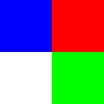
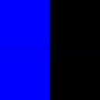
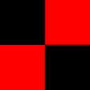
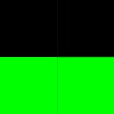

# Лабораторная работа №2

## Формулировка задания
Для произвольного цветного изображения RGB выбрать одну из составляющих палитры.

## Результаты
Исходный код в файле [lab2.py](lab2.py)

Начальное изображение

Изображение после исключения синего и зелёного спектров

Изображение после исключения красного и зелёного спектров

Изображение после исключения синего и красного спектров

