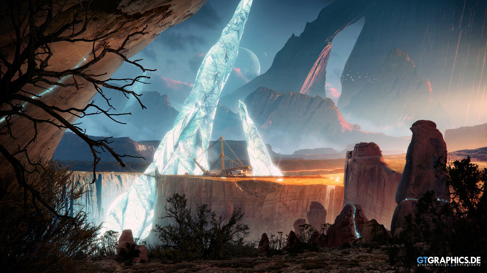
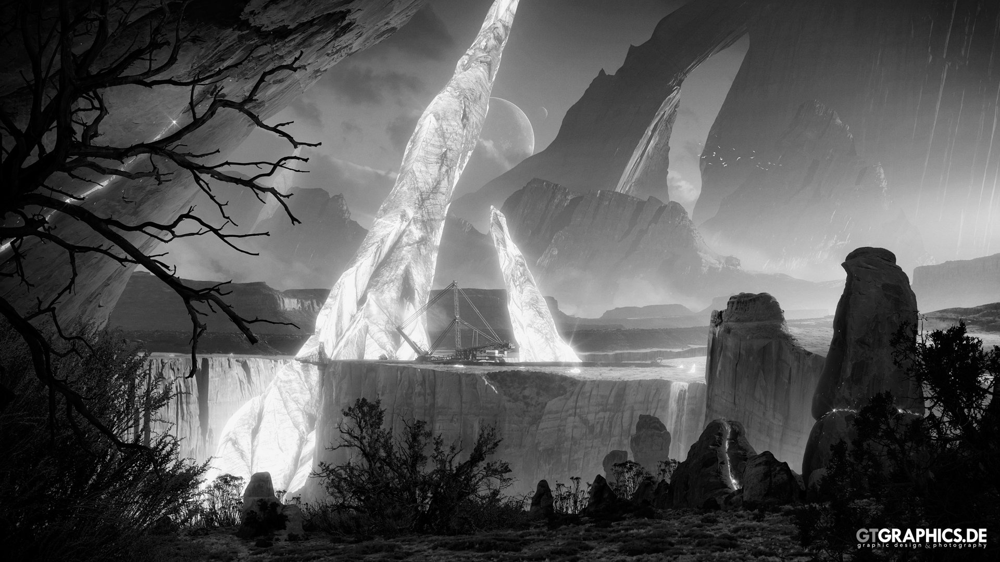

# Лабораторная работа №3

## Формулировка задания
Преобразовать цветное изображение в полутоновое. Показать результат

## Результаты
Исходный код в файле [lab3.py](lab3.py)

Исходное изображение [img1.jpg](img1.jpg)

Изображение в полутоне [grey_img1.jpg](grey_img1.jpg)

