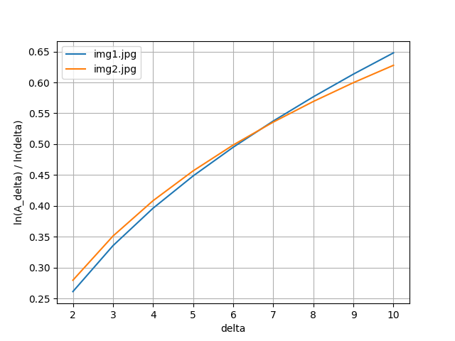

# Лабораторная работа №6

## Формулировка задания
Вычислить вектор размерностей Миньковского для числа итераций 10. Можно использовать как симметричный так и асиметричный методы

## Результаты

Изображения для которых производились расчёты:

[img1.jpg](img1.jpg)

[img2.jpg](img2.jpg)

Результат: [plot.png](plot.png)

