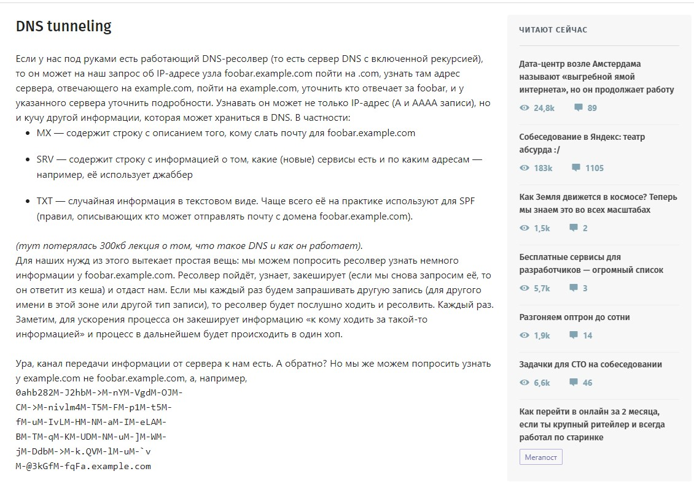
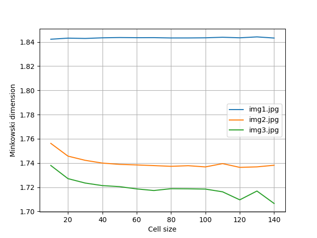

# Лабораторная работа №7

## Формулировка задания
Вычислить размерность Минковского при изменении размера ячейки разбиения

## Результаты
Код в файле [lab7.py](lab7.py)

Размерности вычислялись для следующих изображений:

[img1.jpg](img1.jpg)

[img2.jpg](img2.jpg)

[img3.jpg](img3.jpg)

График иллюстрирующий зависимости при изменении размеров ячейки разбиения ([plot.png](plot.png)):

